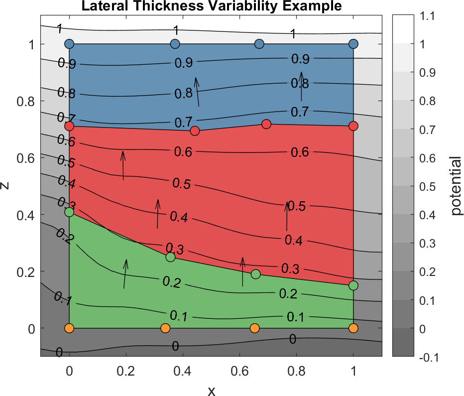

# stratpot

Adrian Tasistro-Hart

 

library for producing numerical models of stratigraphies

## 2D Example

Below is an example of stratpot output in two dimensions for a simple stratigraphy defined by four interfaces, for which three interior beds (blue, red, green) are shown.

## To Do

-   [ ] look into Gaussian process formulation of stratpot
    -   [ ] allow user to specify uncertainty on bed trace and gradient locations
    -   [ ] return uncertainty of interpolated potential
    -   [ ] relax constraint that kriging is exact interpolator, need to be able to account for uncertainty in input data (see gaussian process notebook)
-   [ ] restructure stratpot.m
    -   [ ] separate estimation of covariance parameters from interpolation of potential
    -   [ ] get rid of all the auxiliary functions, put into own files
-   [ ] create covest.m for estimation of covariance parameters
    -   [ ] change how I compute covariance models; should just loop instead of constructing gigantic arrays
    -   [ ] ditch variograms, work with covariance models/kernels
    -   [ ] IMPORTANT need to verify if I need to actually use variograms instead of covariance models since kriging assumes zero mean variables if we proceed with covariance models rather than variograms. Given that the gradient data are not zero mean, then maybe we do need to be using variograms.
    -   [ ] reassess implementation of anisotropy
-   [ ] sparsifyBedtraces()
-   [ ] sparsifyGradients()
-   [ ] setup wiki
    -   [ ] finish documenting all functions
    -   [ ] introduction with figures from examples
    -   [ ] mathematical background
    -   [ ] describe inputs in greater detail
